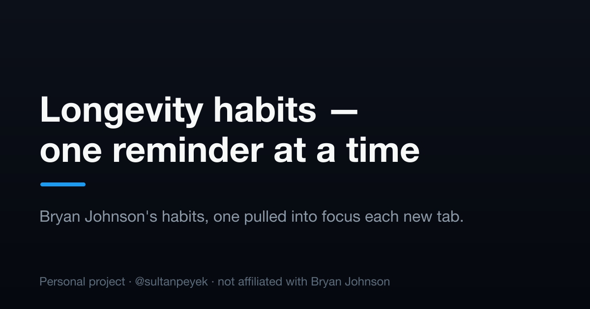

# Bryan Johnson — Longevity Advice

A single-file web app I open as a new-tab page. Each load surfaces one of Bryan Johnson's
42 longevity habits, big and centered, so I act on one thing instead of scrolling past the
whole list. On a phone the habits become an iOS-style glass wheel: swipe to scroll, release
to snap the nearest line under a fixed frosted lens.

🔗 **Live:** https://sultanpeyek.github.io/bryan-johnson-longevity/



> ⚠️ **Unofficial, personal project.** Not affiliated with, endorsed by, or sponsored by
> Bryan Johnson. The habits are quoted from his public post for commentary and
> educational purposes. See [DISCLAIMER.md](DISCLAIMER.md).

## Controls

| Action | Touch | Keyboard |
| --- | --- | --- |
| Random habit | "Pick another" button | `Space` / `Enter` |
| Step through | Flick left / right | `→` `↓` `j` / `←` `↑` `k` |
| Focus a line | Tap it | — |
| Read all | "Show all" button | `Esc` or tap the backdrop |
| Toggle dark mode | ◑ button (top-left) | — |

The wheel works like an iOS picker: the lens stays put, the habits move, and a flick past
the ends rubber-bands. Floating controls fade when idle and return on any input.

## Run locally

One HTML file, no build step. Serve it (so the service worker registers):

```bash
python3 -m http.server 8000
# open http://localhost:8000
```

## Tech

Plain HTML/CSS/JS — no dependencies, no framework, no build. Works offline as a PWA.
Animation follows [Emil Kowalski's](https://animations.dev/) principles and the
[Vercel Web Interface Guidelines](https://vercel.com/design/guidelines).

## License

Code and design are **MIT**; see [LICENSE](LICENSE). The quoted habits remain their
author's work. See [DISCLAIMER.md](DISCLAIMER.md).

Built by [@sultanpeyek](https://github.com/sultanpeyek).
